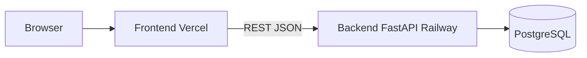
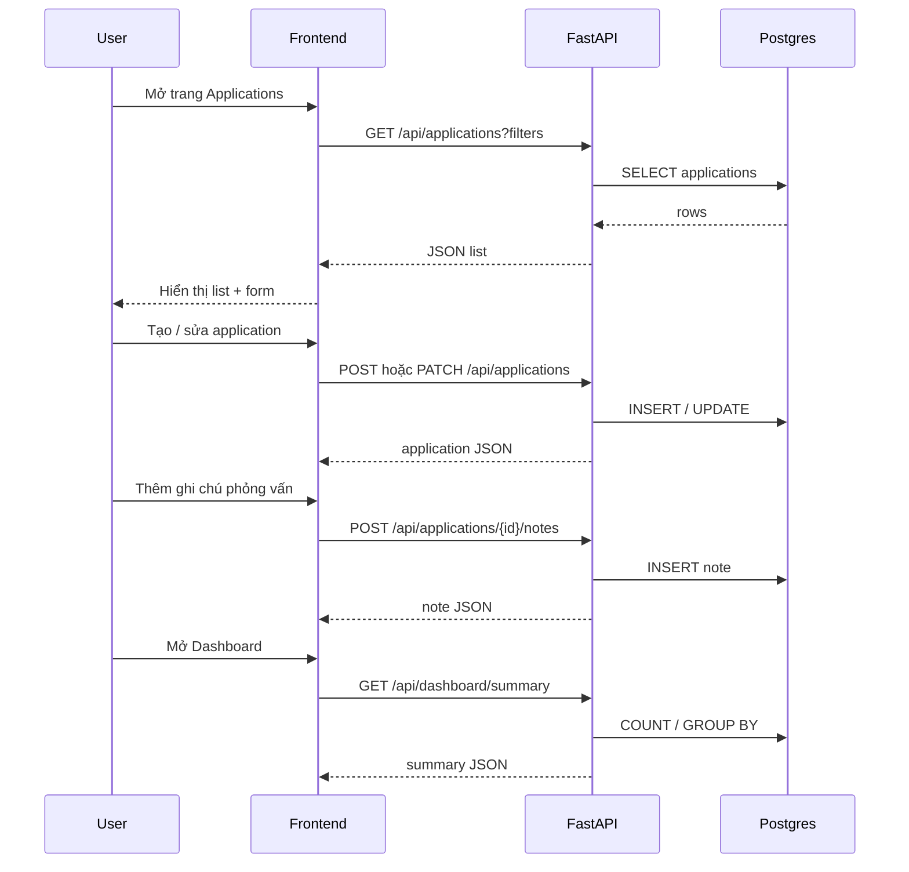

# Architecture — Job Search Command Center

## Tổng quan

Web app single-user, không auth. Frontend (React + Vite) gọi REST API (FastAPI) qua HTTPS. Postgres lưu applications và notes. Deploy: backend Railway, frontend Vercel.



## Nguyên tắc thiết kế MVP

- **Entity gốc:** `job_applications`. Mọi ghi chú gắn qua FK `application_id`.
- **Không bảng `companies` riêng:** lưu `company_name` trực tiếp trên application (đủ cho filter/sort MVP).
- **Trạng thái pipeline:** enum trên application, cập nhật qua PATCH cùng endpoint update.
- **Interview nhiều vòng:** status `interview` trên application + nhiều note `note_type = interview`.
- **Dashboard:** aggregate từ DB, không cache riêng.

## Cấu trúc repo

```
job-search-command-center/
├── backend/
│   ├── app/
│   │   ├── main.py              # FastAPI app, CORS, routers
│   │   ├── config.py            # Settings từ env
│   │   ├── database.py          # Engine, session
│   │   ├── models/              # SQLAlchemy models
│   │   ├── schemas/             # Pydantic request/response
│   │   ├── routers/             # applications, notes, dashboard, health
│   │   └── services/            # Query & business logic
│   ├── alembic/
│   └── requirements.txt
├── frontend/
│   ├── src/
│   │   ├── api/                 # API client
│   │   ├── components/          # List, form, dashboard widgets
│   │   ├── pages/               # ApplicationsPage, DashboardPage
│   │   └── types/               # TS types khớp API
│   └── package.json
└── docs/
```

## Luồng chính



## Frontend — màn hình

| Route | Mục đích |
|-------|----------|
| `/` | Danh sách applications + form tạo/sửa (một màn hình) |
| `/dashboard` | Tổng quan số liệu aggregate |

State: fetch từ API, không localStorage làm source of truth.

## Backend — layers

| Layer | Trách nhiệm |
|-------|-------------|
| Router | HTTP, query params, status code |
| Schema | Validation request/response (Pydantic) |
| Service | Filter, sort, dashboard counts |
| Model | SQLAlchemy ORM, enum, relationships |

## Enum & quy ước

### `application_status`

`applied` · `screening` · `interview` · `offer` · `rejected` · `on_hold`

### `job_type`

`full_time` · `internship` · `freelance`

### `note_type`

| Value | Dùng cho |
|-------|----------|
| `apply` | Ghi nhận ngày apply (bổ sung cho `applied_at`) |
| `interview` | Lịch / diễn biến phỏng vấn (nhiều vòng) |
| `question` | Câu hỏi khó |
| `feedback` | Feedback recruiter / hiring manager |
| `general` | Ghi chú tự do |

### Đếm interview đã diễn ra (dashboard)

```
COUNT(application_notes)
WHERE note_type = 'interview'
  AND interview_completed = TRUE
```

Mỗi note interview đánh dấu `interview_completed = true` khi vòng đó đã xong.

## Filter & sort (list applications)

Query params trên `GET /api/applications`:

| Param | Kiểu | Mô tả |
|-------|------|-------|
| `status` | enum | Lọc theo trạng thái |
| `company` | string | ILIKE partial match `company_name` |
| `position` | string | ILIKE partial match |
| `source` | string | Exact hoặc ILIKE match |
| `sort` | string | `applied_at` (default), `company_name`, `position`, `status`, `created_at` |
| `order` | `asc` \| `desc` | Default `desc` |

## Xóa dữ liệu

- `DELETE /api/applications/{id}`: hard delete application; notes cascade xóa theo FK.
- MVP không soft delete.

## Config & deploy

| Biến | Môi trường | Mục đích |
|------|------------|----------|
| `BACKEND_ENV` | Backend | Môi trường (`local`, production, …) |
| `BACKEND_PORT` | Backend | Port tham chiếu cho local dev |
| `DATABASE_URL` | Backend | Postgres connection string |
| `CORS_ORIGINS` | Backend | URL frontend Vercel (comma-separated) |
| `VITE_API_BASE_URL` | Frontend | Base URL API Railway |

Chi tiết local DB + Docker: [`docs/environment.md`](environment.md).

- `GET /api/health`: `{ "status": "ok" }` — app health (Railway có thể dùng endpoint này).
- `GET /api/health/db`: `{ "database": "ok" }` — kiểm tra kết nối Postgres.
- CORS chỉ allow origin frontend production + `localhost` dev.

## Error handling

| HTTP | Khi nào |
|------|---------|
| 400 | Validation fail (Pydantic) |
| 404 | Application / note không tồn tại |
| 422 | Body/query không hợp lệ |
| 500 | Lỗi server không mong đợi |

Response lỗi chuẩn: `{ "detail": "..." }` (FastAPI default).
