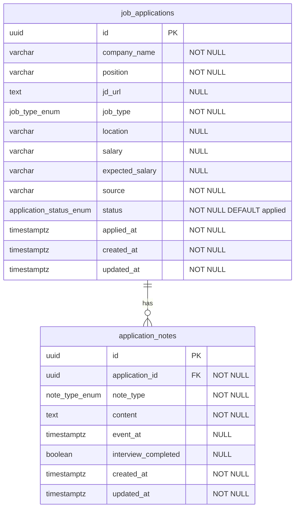

# ERD — Job Search Command Center

## Diagram



---

## Bảng `job_applications`

Entity gốc — một lần ứng tuyển vào một vị trí tại một công ty.

| Column | Type | Nullable | Default | Ghi chú |
|--------|------|----------|---------|---------|
| `id` | `UUID` | NO | `gen_random_uuid()` | PK |
| `company_name` | `VARCHAR(255)` | NO | — | Tên công ty (embedded, không FK) |
| `position` | `VARCHAR(255)` | NO | — | Tên vị trí |
| `jd_url` | `TEXT` | YES | — | Link job description |
| `job_type` | `job_type_enum` | NO | — | `full_time`, `internship`, `freelance` |
| `location` | `VARCHAR(255)` | YES | — | Địa điểm / remote |
| `salary` | `VARCHAR(100)` | YES | — | Mức lương JD (text tự do) |
| `expected_salary` | `VARCHAR(100)` | YES | — | Kỳ vọng lương |
| `source` | `VARCHAR(100)` | NO | — | VD: `linkedin`, `referral`, `company_website` |
| `status` | `application_status_enum` | NO | `applied` | Pipeline status |
| `applied_at` | `TIMESTAMPTZ` | NO | `now()` | Ngày apply — dùng filter/sort |
| `created_at` | `TIMESTAMPTZ` | NO | `now()` | |
| `updated_at` | `TIMESTAMPTZ` | NO | `now()` | Auto-update on change |

**Indexes**

| Name | Columns | Unique |
|------|---------|--------|
| `pk_job_applications` | `id` | YES (PK) |
| `ix_job_applications_status` | `status` | NO |
| `ix_job_applications_applied_at` | `applied_at` | NO |
| `ix_job_applications_company_name` | `company_name` | NO |

**Không có unique constraint** trên `(company_name, position)` — user có thể apply cùng công ty nhiều vị trí hoặc re-apply.

---

## Bảng `application_notes`

Ghi chú gắn với một application.

| Column | Type | Nullable | Default | Ghi chú |
|--------|------|----------|---------|---------|
| `id` | `UUID` | NO | `gen_random_uuid()` | PK |
| `application_id` | `UUID` | NO | — | FK → `job_applications.id` ON DELETE CASCADE |
| `note_type` | `note_type_enum` | NO | — | Xem enum bên dưới |
| `content` | `TEXT` | NO | — | Nội dung ghi chú |
| `event_at` | `TIMESTAMPTZ` | YES | — | Ngày apply / lịch phỏng vấn |
| `interview_completed` | `BOOLEAN` | YES | — | Chỉ dùng khi `note_type = interview`; `true` = đã diễn ra |
| `created_at` | `TIMESTAMPTZ` | NO | `now()` | |
| `updated_at` | `TIMESTAMPTZ` | NO | `now()` | |

**Indexes**

| Name | Columns | Unique |
|------|---------|--------|
| `pk_application_notes` | `id` | YES (PK) |
| `ix_application_notes_application_id` | `application_id` | NO |
| `ix_application_notes_note_type` | `note_type` | NO |

**FK**

```
application_notes.application_id → job_applications.id
  ON DELETE CASCADE
  ON UPDATE CASCADE
```

---

## PostgreSQL enums

### `application_status_enum`

```
applied | screening | interview | offer | rejected | on_hold
```

### `job_type_enum`

```
full_time | internship | freelance
```

### `note_type_enum`

```
apply | interview | question | feedback | general
```

---

## Quy tắc field

| Rule | Chi tiết |
|------|----------|
| `interview_completed` | Chỉ set khi `note_type = interview`. Backend validate: nếu `note_type != interview` thì phải `NULL`. |
| `applied_at` trên application | Canonical cho sort/filter theo ngày apply. Note `apply` là bổ sung, không override. |
| `salary` / `expected_salary` | Text tự do (VD: `"3000 USD"`, `"40M VND"`), không parse số ở MVP. |
| `source` | Free-form string; frontend có thể gợi ý preset nhưng DB không enum. |

---

## Migration

- Alembic revision đầu: tạo enums + 2 bảng + indexes.
- Không seed data bắt buộc.
